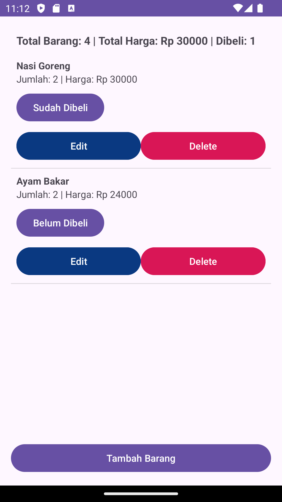

# Daftar Belanja App

Aplikasi sederhana untuk mengelola daftar belanja, dilengkapi dengan fitur CRUD (Create, Read, Update, Delete).

## Fitur

- **Tambah Barang**: Tambahkan barang belanjaan dengan nama, jumlah, dan harga.
- **Lihat Barang**: Tampilkan daftar barang belanjaan yang tersimpan.
- **Edit Barang**: Ubah nama, jumlah, atau harga barang yang sudah ada.
- **Hapus Barang**: Hapus barang dari daftar belanja.
- **Toggle Status**: Tandai barang apakah sudah dibeli atau belum.

## Teknologi yang Digunakan

- **Kotlin**: Bahasa pemrograman utama.
- **RecyclerView**: Untuk menampilkan daftar belanja.
- **AlertDialog**: Untuk mengedit item.
- **Android Studio**: Lingkungan pengembangan.

